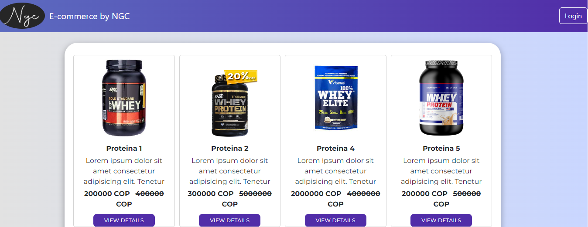
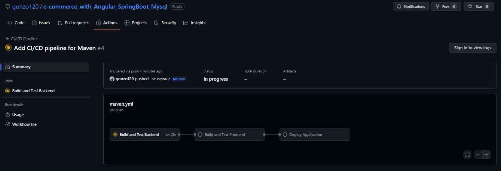

# Proyecto Full Stack: Angular y Spring Boot

Este proyecto es una aplicación full stack que utiliza Angular para el frontend y Spring Boot para el backend.

## Pagina de inicio



## Login


## Requisitos

- Node.js (versión 18 o superior)
- Angular CLI (versión 17)
- Java JDK (versión 17)
- Maven (versión 3.6 o superior)
- Docker (opcional, para contenedores)
- GitHub Action (para CI/CD)

## Configuración del Frontend (Angular)

1. **Instalar dependencias**:

   ```sh
   cd frontend
   npm install
   ng serve

## Configuración del Backend (Spring Boot)

1. **Construir el archivo JAR**:

    ```sh
    cd jwt
    mvn clean package

2. **Ejecutar la aplicación Spring Boot:**:

    ```sh
    Generar base de datos en Mysql y reemplazar el nombre en el archivo
    applicatio.properties
    spring.datasource.url=jdbc:mysql://localhost:3306/tu-base-de-datos
    java -jar target/jwt-0.0.1-SNAPSHOT.jar

## Uso Docker File (Opcional)

# Frontend 

1. **Construir y ejecutar el contenedor Docker**:

    ```sh
    cd Frontend
    docker build -t mi-aplicacion-angular .
    docker run -d -p 80:80 mi-aplicacion-angular

# Backend 

2. **Construir y ejecutar el contenedor Docker**:

    ```sh
    cd jwt
    docker build -t mi-aplicacion-springboot .
    docker run -d -p 9090:9090 mi-aplicacion-springboot

## Notas

    -Asegúrate de que los puertos 4200 y 9090 estén disponibles en tu máquina.
    -Puedes personalizar los archivos Dockerfile y nginx.conf según tus necesidades específicas.
¡Y eso es todo! Ahora deberías tener tu aplicación full stack corriendo tanto en tu máquina local como en contenedores Docker. Si tienes alguna pregunta o necesitas más ayuda, ¡no dudes en preguntar!


## Uso de configuracion CI/CD




## Configuración de CI/CD con GitHub Actions

### Frontend (Angular)

1. **Crear el archivo `.github/workflows/frontend.yml`**:

   ```yaml
   name: CI/CD Frontend

   on:
     push:
       branches:
         - main

   jobs:
     build:
       runs-on: ubuntu-latest

       steps:
         - name: Checkout code
           uses: actions/checkout@v2

         - name: Set up Node.js
           uses: actions/setup-node@v2
           with:
             node-version: '18'

         - name: Install dependencies
           run: npm install
           working-directory: ./frontend

         - name: Build Angular app
           run: npm run build --prod
           working-directory: ./frontend

         - name: Deploy to Docker Hub
           run: |
             docker build -t mi-aplicacion-angular ./frontend
             echo ${{ secrets.DOCKER_PASSWORD }} | docker login -u ${{ secrets.DOCKER_USERNAME }} --password-stdin
             docker push ${{ secrets.DOCKER_USERNAME }}/mi-aplicacion-angular


             ## Configuración de CI/CD con GitHub Actions

### Frontend (Angular)

# Backend (Spring Boot)

1. **Crear el archivo `.github/workflows/backend.yml`**:

name: CI/CD Backend

on:
  push:
    branches:
      - main

jobs:
  build:
    runs-on: ubuntu-latest

    steps:
      - name: Checkout code
        uses: actions/checkout@v2

      - name: Set up JDK
        uses: actions/setup-java@v2
        with:
          java-version: '17'

      - name: Build with Maven
        run: mvn clean package
        working-directory: ./backend

      - name: Deploy to Docker Hub
        run: |
          docker build -t mi-aplicacion-springboot ./backend
          echo ${{ secrets.DOCKER_PASSWORD }} | docker login -u ${{ secrets.DOCKER_USERNAME }} --password-stdin
          docker push ${{ secrets.DOCKER_USERNAME }}/mi-aplicacion-springboot
